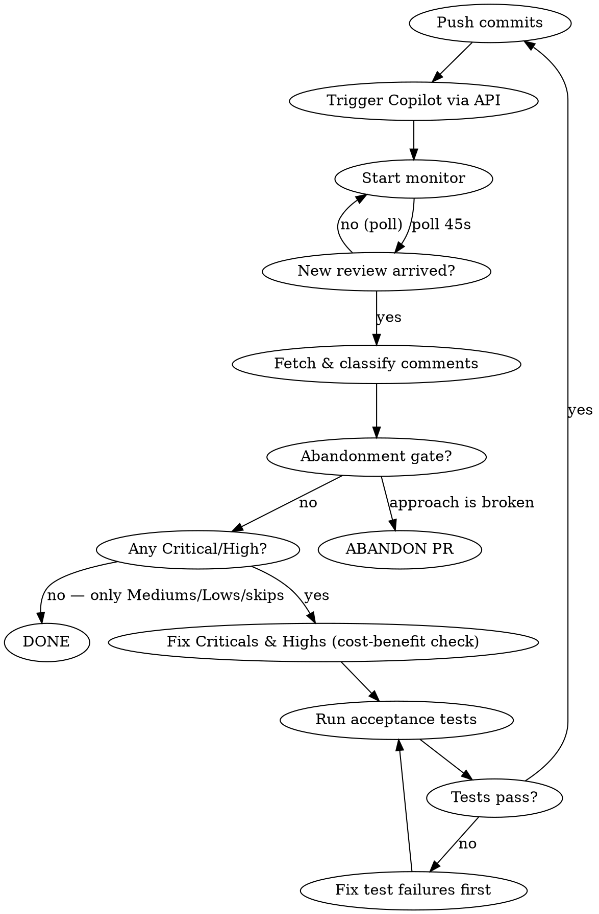

# Copilot PR Review Loop

## Overview

Automate the full push → trigger → monitor → evaluate → fix → test → push cycle until Copilot produces no new actionable suggestions. Never wait for the user to click the Copilot "re-review" button — trigger it via API.

## Loop Flowchart



## Step-by-Step

### 1. Trigger Copilot review via API

```bash
gh api repos/{owner}/{repo}/pulls/{pr_number}/requested_reviewers \
  -X POST -f 'reviewers[]=copilot-pull-request-reviewer[bot]' \
  --jq '.requested_reviewers[0].login'
# Expected output: "Copilot"
```

### 2. Start monitor (poll for new review ID)

```bash
LAST_ID=$(gh api repos/{owner}/{repo}/pulls/{pr}/reviews \
  --jq 'map(select(.user.login == "copilot-pull-request-reviewer[bot]")) | max_by(.id) | .id')

# Then start background monitor:
while true; do
  NEW_ID=$(gh api repos/{owner}/{repo}/pulls/{pr}/reviews \
    --jq 'map(select(.user.login == "copilot-pull-request-reviewer[bot]")) | max_by(.id) | .id' 2>/dev/null)
  if [ -n "$NEW_ID" ] && [ "$NEW_ID" -gt "$LAST_ID" ] 2>/dev/null; then
    echo "=== NEW COPILOT REVIEW id=$NEW_ID ==="
    gh api repos/{owner}/{repo}/pulls/{pr}/reviews/$NEW_ID/comments \
      --jq '.[] | "[\(.path)] \(.body[:300])"' 2>/dev/null
    LAST_ID=$NEW_ID
  fi
  sleep 45
done
```

Use the `Monitor` tool — **never poll manually in a sleep loop inside your turn.**

### 3. Evaluate each comment

**Before deciding adopt/skip, ask two questions:**

1. **Root cause:** Is this a code defect, or a language/platform constraint (e.g., Python threads can't be cancelled, JS is single-threaded)? If constraint → SKIP the entire category; complexity workarounds only create new angles for future rounds.
2. **Scope:** Does the fix require changing an external module's API, adding process isolation, or a new DB migration? If yes → default SKIP unless it's a security/correctness blocker.

For every comment, decide **adopt** or **skip**:

| Adopt | Skip |
|-------|------|
| Type safety issues | a11y improvements (unless in scope) |
| Real bugs (null safety, race conditions, data correctness) | Already-skipped repeats from prior rounds |
| Memory leaks / timer cleanup | Out-of-scope refactors |
| Inconsistencies between layers (mock vs. real types) | Cosmetic style preferences |
| | Suggestions that require refactoring an external module's API |
| | Suggestions whose root cause is a language/platform limitation |

**Cycle detection:** If the same file or component receives suggestions in 3+ consecutive rounds, stop and identify the underlying constraint before adopting anything. Cycling = the same fundamental tension being re-expressed in new forms. Adopting each new expression makes the code more complex without solving the root issue.

Show a triage table before fixing. Never silently skip — state the reason.

### 3a. Severity classification + triage log

**Before classifying any comment, check the triage log first.**

The triage log is a running record that persists across rounds. Its purpose: prevent re-classifying a comment that was already decided.

**Location (deterministic priority):** Use a draft PR comment as the primary location (create one titled `[copilot-triage]` in round 1, update it each round). Fall back to `copilot-triage.md` in the repo root (add to `.gitignore`) only if the GitHub draft comment API is unavailable. Never use both — pick one at round 1 and stick with it.

Format:

```
## Round N — <date>
| Comment ID (file:line or hash) | Severity | Decision | Reason |
| foo.ts:42 | High | SKIP (cost-benefit) | 80-line refactor for <0.1% path, already guarded at API layer |
| bar.py:17 | Critical | ADOPT | null-deref on empty input crashes the worker |
```

At the start of each round, load the triage log. Any comment that appears in a prior round's log with a `SKIP` or `ADOPT` decision is **not re-classified** — carry the prior decision forward unless the code change in the new commit has materially changed the comment's context.

**For new comments (not yet in the log)**, classify using this table:

| Severity | Criteria | Examples |
|----------|----------|---------|
| **Critical** | Correctness/security breakage; would cause data loss, auth bypass, crash in production | SQL injection, null-deref crash, broken auth check, data corruption |
| **High** | Real bug or significant regression risk; not immediately catastrophic but wrong | Race condition, off-by-one producing wrong output, memory leak in hot path |
| **Medium** | Code quality issue; maintainability, readability, or mildly incorrect behavior | Inconsistent types, missing error handling for rare path, dead code with side effects |
| **Low** | Style, cosmetics, minor naming | Unused import, comment wording, variable name |

When two criteria apply (e.g., a correctness AND a style issue in the same comment), classify at the higher severity.

**Fix order:** Criticals first (all of them), then Highs, then stop for termination check. Mediums and Lows are never the reason to trigger another round. Write every classification to the triage log immediately.

### 3b. Cost-benefit gate for Highs and Mediums

Before fixing any High or Medium, ask: **is the juice worth the squeeze?**

**Hard exclusion — skip this gate entirely for:**
- Any **security** issue (auth, input validation, injection, privilege escalation)
- Any **data correctness** issue — specifically: silent data loss (data written as missing/null when it should exist), corrupted write (wrong value committed to DB/persistent state), or wrong computation that drives downstream consequential decisions (billing totals, authorization checks, ordering of financial data)
- Any issue Copilot labels as a security advisory

These must be fixed regardless of cost. Cost and risk are orthogonal; for safety/correctness issues, risk is never "narrow" enough to justify skipping.

For all other Highs and Mediums, SKIP if **both** of the following are true:
1. The fix is substantial: >50 lines of net new logic, or requires new abstractions/cross-module rewiring (mechanical renames don't count)
2. The risk is mitigated or contained: the affected path is already guarded upstream, or the failure mode requires abnormal conditions that are handled by an external layer (retry, circuit breaker, user-facing error)

Examples of *not* worth the squeeze:
- 100-line refactor to handle a malformed input already validated at the API boundary
- Adding process isolation to protect against a race condition that only occurs during abnormal shutdown
- Splitting a module for single-responsibility when there is no current maintainability pain

Log every such skip as `SKIP (cost-benefit)` in the triage log with a one-line reason. Never silently skip.

### 3c. Abandonment gate

Before fixing anything in a new round, scan all open Criticals and ask: **do the Criticals point to a systemic design flaw, or are they isolated fixable bugs?**

**Primary trigger (design-flaw pattern):** If 2+ open Criticals share a root cause — same wrong data model, same misunderstood API contract, same concurrency model — the PR has a structural problem. Fixing individual Criticals will not converge; each fix spawns new violations of the same root assumption.

Read the relevant functions (max 2 files) to confirm a shared assumption before triggering the abandonment signal. Copilot comments describe symptoms, not causes — don't infer root cause from comment text alone.

**Secondary signal (volume heuristic):** Many distinct Criticals across unrelated subsystems can also indicate a fundamentally misguided approach, but treat this as a prompt to assess the design-flaw pattern above — not as a standalone trigger. Do not surface an abandonment signal based on count alone without identifying a unifying pattern.

When the primary trigger fires, stop and surface to the user. The `Pattern type` field must use one of the concrete categories below — not freeform prose:

```
⛔ ABANDONMENT SIGNAL
Open Criticals: N (list each one with file:line)
Pattern type: <one of: wrong data model | wrong API contract assumption | wrong concurrency model | wrong abstraction boundary | wrong security boundary>
Shared root cause: <one sentence — what the wrong assumption is>
Why fixing individually won't converge: <one sentence — what new violations each fix spawns>
Recommendation: Close this PR and revisit the approach before re-implementing.
```

**If the user does not respond within the same session:** Default to pausing the loop (do not commit, do not fix). Note the paused state in the triage log. Resume only when the user explicitly confirms to continue or abandon.

The user decides whether to abandon or override. Don't abandon silently or autonomously.

### 4. Run acceptance tests

**⚠️ MANDATORY before every commit. If no acceptance test is defined for the project, WARN loudly:**

```
⚠️ WARNING: No acceptance tests found for this project.
Manually verify all changed behavior before committing.
```

Check project memory / CLAUDE.md for the designated acceptance test command.
Example pattern: `LVT_RUN_E2E=1 uv run pytest tests/test_e2e_full_pipeline.py`

If tests fail → fix failures before committing, never skip.

### 5. Commit and push

```bash
git add <changed files>
git commit -m "fix(copilot-review): round N — <short summary>"
git push
```

Then immediately re-trigger Copilot (step 1) and restart monitor (step 2).

## Termination Condition

Stop looping when **all** of the following hold:
- **No open Criticals** — zero remaining
- **No open Highs** that passed the cost-benefit gate — either fixed or explicitly skipped
- Remaining open comments are Mediums/Lows or previously-skipped items

Also stop (and surface abandonment signal) if the open Criticals indicate the underlying approach is broken (see §3c).

**Blocked state** — stop and surface the blocked signal if the loop cannot continue due to external infrastructure issues (not design flaws). This is distinct from abandonment: abandonment means the PR's approach is broken; blocked means the tooling or environment is broken. Do not commit, do not push, do not close the PR. Examples: acceptance tests hang for multiple consecutive runs without a code change, Copilot API consistently returns errors or no new review after 3+ trigger attempts, authentication failures, GitHub API quota exhausted.

```
⛔ LOOP BLOCKED
Reason: <one sentence describing the infrastructure problem>
Last attempted: <the last operation tried>
Suggested action: <what the user should do next to unblock>
```

Document final skipped items in the PR or a comment.

After the loop ends, output a **complete triage table** covering every comment from every round:

```
| Round | File | Comment summary | Decision | Reason |
|-------|------|-----------------|----------|--------|
| 1     | foo.tsx | … | ADOPT | … |
| 1     | bar.py  | … | SKIP  | … |
| 2     | …       | … | ADOPT | … |
```

This gives the reviewer a single place to audit all decisions without scrolling through individual round outputs.

## Common Mistakes

| Mistake | Fix |
|---------|-----|
| Waiting for user to click Copilot button | Always use `gh api ... -X POST -f 'reviewers[]=copilot-pull-request-reviewer[bot]'` |
| Using timestamps to detect new reviews | Use integer `.id` comparison — timestamps have race conditions |
| Committing without running acceptance tests | Non-negotiable gate, even for "obviously safe" changes |
| Silently skipping comments | State skip reason explicitly in your response |
| Forgetting to restart monitor after re-trigger | Monitor → trigger → new review → fetch → fix → push → trigger → monitor |
| Adopting a11y suggestions outside scope | Note as out-of-scope, do not apply unless current phase covers a11y |
| Cycling through solutions to a systemic constraint | After 2 rounds on the same issue, identify the root constraint. If it's unsolvable in this PR (e.g., non-cancellable threads), SKIP the whole category and document the known limitation — don't keep adding complexity |
| Adopting every suggestion to avoid conflict | Blind adoption inflates complexity. SKIP is the correct response when the root cause is a platform limit or the fix is out of scope |
| Fixing Mediums before all Criticals/Highs are resolved | Always drain Critical → High before touching lower severities |
| Fixing a High with poor cost-benefit | Apply the juice-vs-squeeze gate (§3b): if fix is costly and risk is narrow, SKIP with reason |
| Continuing to fix after abandonment signal | When 2+ Criticals share a root cause pattern, surface abandonment signal to user instead of patching symptoms |
| Re-classifying a comment already in the triage log without a stated reason | Check triage log at round start; carry prior decisions forward unless you can explicitly state what changed in the new commit |
| Starting a new round without loading the triage log | The log is the memory of the loop — skipping it risks re-opening already-decided items and infinite cycling |
